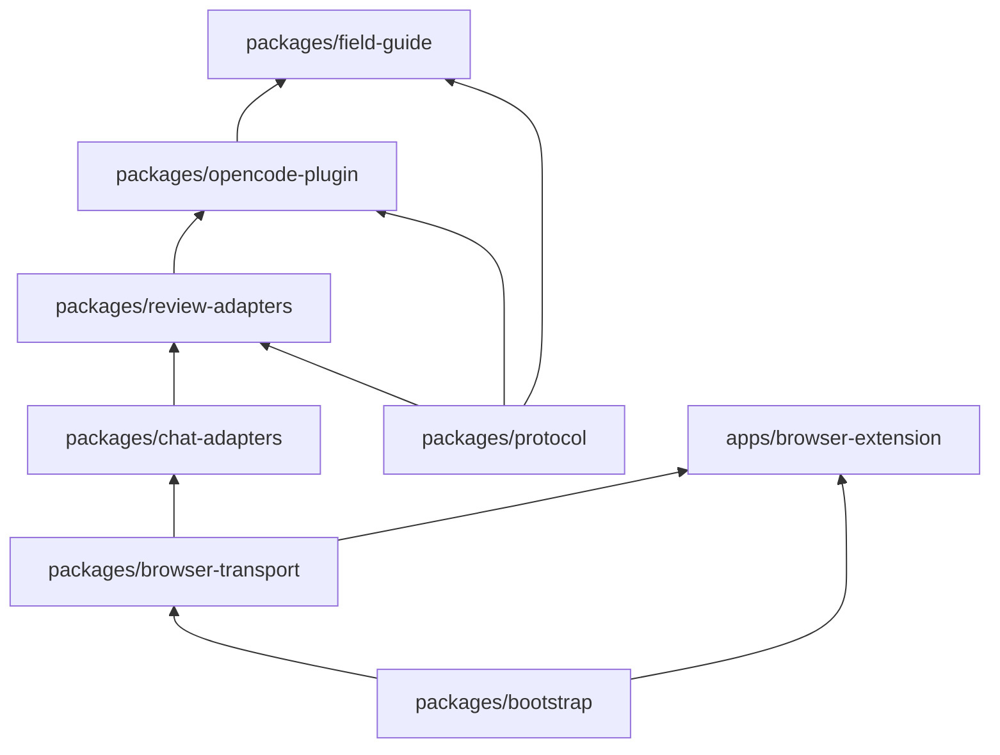

# PlanLoop Implementation Plan

Greenfield build in [c:\Users\kesha\PlanLoop](c:\Users\kesha\PlanLoop). Design is frozen at Spec v1.0 with three final amendments: **generic Browser Transport**, **protocol compatibility ranges**, and **Reasoning Trace**; confidence is telemetry-only, not an approval gate.

**This is Spec v1.0.** Implementation targets this exact specification. Do not modify `packages/spec` during implementation except for genuine defects. Use the Field Guide to capture lessons that emerge rather than expanding the architecture.

PlanLoop is a three-part system with a foundational DX layer and a spec-driven implementation:

0. **Spec Package** — Single source of truth: product definition, component contracts, event definitions, ADRs, acceptance tests, failure matrix, ownership boundaries. The implementation plan builds what the spec defines.
1. **Bootstrap Engine** — Developer experience: environment detection, one-command setup, diagnostics, health checks. A developer should be productive within 5 minutes of cloning.
2. **Planning Engine** — Creates and refines implementation plans.
3. **Review Engine** — Reviews plans, requests more context, and drives revisions.
4. **Knowledge Engine (Field Guide)** — Extracts durable project-specific knowledge from planning sessions, reviews, commits, and implementations. This is what makes the system improve over weeks and months without requiring larger context windows or changing models.

The Field Guide is not documentation. It is **persistent project memory** — distilled lessons that influence future planning before any review happens.

---

## Monorepo Layout

```
PlanLoop/
├── packages/
│   ├── spec/                  # Phase -2 — Product spec, contracts, events, ADRs, acceptance tests, manifest
│   ├── bootstrap/             # Phase -1 — Developer Experience: installer, diagnostics, health checks
│   ├── protocol/              # Phase 0 — JSON Schemas, validators, fixtures, compat tests
│   ├── browser-transport/     # Phase 1 — WebSocket bridge + extension (transport-agnostic)
│   ├── chat-adapters/         # Phase 2 — ChatGPT chat adapter on top of transport
│   ├── review-adapters/       # Phase 2 — ReviewAdapter implementations
│   ├── opencode-plugin/       # Phase 3–4 — OpenCode plugin + orchestrator
│   └── field-guide/           # Phase 5 — Knowledge Engine: extractor, storage, index, planner integration
├── apps/
│   └── browser-extension/     # Chrome/Edge MV3 extension (generic transport client)
└── package.json               # npm workspaces (Bun-compatible)
```

Dependency direction (strict, no cycles):



---

## Frozen Design Decisions

| Decision | Rule |
|----------|------|
| Installation | A developer should be productive within 5 minutes of cloning. Any manual steps must be unavoidable due to platform security and automatically detected. |
| Browser layer | **Transport only** — no ReviewPacket, PlanLoop, OpenCode, or protocol knowledge |
| Approval gate | **Deterministic**: zero critical + zero major + verification passed + user confirm |
| Confidence | Recorded in `ReviewResponsePacket.scores` / `confidence` as **telemetry only** |
| Plan updates | OpenCode receives **issues + recommendations + verification** only — never reviewer prose or plan rewrites |
| Default review path | `chatgpt-browser` adapter (ChatGPT Go via browser) |
| Field Guide philosophy | **Persistent project memory**, not documentation — distilled lessons, never raw conversations |
| Knowledge extraction | Every planning iteration extracts durable knowledge; extractor produces principles, not chat logs |
| Guide influences planning | Planner uses Repository + Field Guide + Current Plan — lessons incorporated before review |
| Lesson metadata | Every lesson has id, category, confidence, introduced date, last_used, references, status |
| Run archival | Every planning run stores conversation, plans, reviews, approved plan, and extracted lessons |
| One source of truth | Every concept has exactly one owning package — no duplication across packages |
| Spec-driven | packages/spec/ is the single source of truth; implementation builds what spec defines |
| Failure handling | Every failure mode has detect, recover, retry, abort, notify defined in failure matrix |
| Spec frozen | Spec v1.0 is frozen during implementation; changes require version bump and ADR |
| Spec freeze | SPEC_FREEZE.md declares frozen status; no architecture discussions during implementation |
| Quality gates | Every phase must pass lint, typecheck, tests (>=90% coverage), forbidden deps, architecture test |
| Performance budgets | Every operation has a timing budget; violations fail CI |
| Observability | Structured JSON logs, metrics, tracing per observability spec |
| Backward compat | Protocol uses semver strictly; other packages follow semver with documented rules |
| Golden demo | Complete happy-path scenario is the canonical integration test; passing it means the system works |
| Reference outputs | Actual JSON fixtures, not pseudocode; implementations compare byte-for-byte |

---

## Phase -2: Specification Package

**Goal:** Define what PlanLoop is and what each component guarantees before any code is written. This is the single source of truth that makes the implementation one-shotable.

### -2.1 Package structure

`packages/spec/`:

```
packages/spec/
├── VERSION                   # Spec version: 1.0.0
├── SPEC_FREEZE.md            # Frozen status declaration
├── golden-demo.md            # Complete happy-path run with inputs/outputs/files/events/logs/transitions
├── product.md                # What PlanLoop does — UX, commands, TUI behavior
├── architecture.md           # System architecture, dependency graph, one source of truth
├── coding-standards.md       # File naming, error handling, logging, TS rules, async patterns, testing style
├── quality-gates.md          # Per-phase quality gates: lint, typecheck, tests, coverage, dependencies
├── invariants.md             # Global rules that must always hold
├── performance-budgets.md    # Timing constraints for every operation
├── observability.md          # Log levels, structured log schema, metrics, tracing, debug mode
├── backward-compat.md        # Patch/minor/major release rules, what can change
├── architecture-tests.md     # Automated tests that verify the architecture itself
├── failure-matrix.md         # Every failure: detect, recover, retry, abort, notify
├── repository-manifest.md    # Packages, responsibilities, commands, config files, ownership
├── contracts/
│   ├── protocol.md           # Protocol package contract
│   ├── bootstrap.md          # Bootstrap package contract
│   ├── browser-transport.md  # Browser transport contract
│   ├── chat-adapters.md      # Chat adapters contract
│   ├── review-adapters.md    # Review adapters contract
│   ├── opencode-plugin.md    # Plugin contract
│   └── field-guide.md        # Field guide contract
├── events/
│   └── event-contract.md     # All events: name, payload, emitter, listeners, retry, idempotent
├── adrs/
│   ├── ADR-001-browser-transport.md
│   ├── ADR-002-deterministic-approval.md
│   ├── ADR-003-confidence-telemetry.md
│   ├── ADR-004-issues-only-revision.md
│   ├── ADR-005-field-guide-memory.md
│   ├── ADR-006-bootstrap-dx.md
│   └── ADR-007-spec-package.md
├── acceptance-tests/
│   ├── phase-m1-bootstrap.test.md
│   ├── phase-0-protocol.test.md
│   ├── phase-1-transport.test.md
│   ├── phase-2-adapters.test.md
│   ├── phase-3-plugin.test.md
│   ├── phase-4-handoff.test.md
│   └── phase-5-knowledge.test.md
├── non-goals/
│   ├── protocol.md
│   ├── bootstrap.md
│   ├── browser-transport.md
│   ├── chat-adapters.md
│   ├── review-adapters.md
│   ├── opencode-plugin.md
│   └── field-guide.md
├── reference-outputs/
│   ├── repository-brief.json
│   ├── review-request-packet.json
│   ├── review-response-packet-passing.json
│   ├── review-response-packet-issues.json
│   ├── context-request-packet.json
│   ├── context-fulfillment-packet.json
│   ├── reasoning-trace.json
│   ├── approved-plan.json
│   ├── lesson.json
│   ├── run-manifest.json
│   ├── log-entry.json
│   └── verification-result.json
├── api/
│   ├── protocol-api.md       # Frozen public API with exact signatures, exceptions, side effects
│   ├── bootstrap-api.md
│   ├── browser-transport-api.md
│   ├── chat-adapters-api.md
│   ├── review-adapters-api.md
│   ├── opencode-plugin-api.md
│   └── field-guide-api.md
└── conformance/
    ├── README.md             # How to run the conformance suite
    ├── contract-tests.md     # Tests: every package matches its contract
    ├── architecture-tests.md # Tests: imports, ownership, API surface, invariants
    ├── acceptance-tests.md   # Tests: Given/When/Then scenarios pass
    ├── performance-tests.md  # Tests: all operations under budget
    └── e2e-tests.md          # Tests: golden demo passes end-to-end
```

### -2.2 Product specification

`packages/spec/product.md` answers: **What does PlanLoop actually do?**

Contents:

- **User story:** Developer types `/planloop` → system plans, reviews, iterates, approves, implements
- **Commands:** `/planloop`, `/planloop status`, `/planloop cancel`, `/planloop history`
- **TUI behavior:** Toast notifications, session list, approval prompts, reasoning trace summaries
- **UX flow:** Step-by-step what the user sees and does at each stage
- **Configuration:** What the user can configure and what defaults are
- **Error UX:** What the user sees when things fail

This is not how it's built. It's what the user experiences.

### -2.3 Component contracts

Every package gets a contract file. Example for `packages/spec/contracts/protocol.md`:

```markdown
# Protocol Package Contract

## Inputs
- ReviewRequestPacket (from plugin)
- ContextFulfillmentPacket (from plugin)

## Outputs
- ReviewResponsePacket (to plugin)
- ContextRequestPacket (to plugin)
- PlanRevisionInstruction (internal)

## Public API
- validate(packet, schema): ValidationResult
- checkCompat(version, range): boolean
- evaluateApproval(response, verification, userConfirmed): ApprovalResult
- buildReasoningTrace(prev, current, verification): ReasoningTrace

## Internal API
- fingerprintIssue(issue): string
- diffIterations(prev, current): TraceDelta

## Dependencies
- ajv (JSON schema validation)

## Forbidden Dependencies
- NO browser APIs
- NO OpenCode SDK
- NO network calls
- NO file system writes (pure functions only)
```

Repeat for every package.

### -2.4 Event contract

`packages/spec/events/event-contract.md`:

```yaml
events:
  - name: PlanCreated
    payload: { runId: string, planPath: string, sessionId: string }
    emitter: opencode-plugin
    listeners: [review-adapter, field-guide]
    retry: exponential backoff, 3 attempts
    idempotent: true

  - name: ReviewStarted
    payload: { runId: string, iteration: number, adapterId: string }
    emitter: opencode-plugin
    listeners: [field-guide]
    retry: none
    idempotent: true

  - name: ReviewCompleted
    payload: { runId: string, iteration: number, response: ReviewResponsePacket }
    emitter: review-adapter
    listeners: [opencode-plugin]
    retry: re-submit via adapter
    idempotent: true

  - name: ContextRequested
    payload: { runId: string, paths: string[], reason: string }
    emitter: review-adapter
    listeners: [opencode-plugin]
    retry: re-request same paths
    idempotent: true

  - name: PlanUpdated
    payload: { runId: string, iteration: number, issuesResolved: number, issuesNew: number }
    emitter: opencode-plugin
    listeners: [field-guide]
    retry: none
    idempotent: true

  - name: ApprovalPassed
    payload: { runId: string, criticalIssues: 0, majorIssues: 0, userConfirmed: true }
    emitter: opencode-plugin
    listeners: [field-guide]
    retry: none
    idempotent: true

  - name: ImplementationStarted
    payload: { runId: string, buildSessionId: string, planPath: string }
    emitter: opencode-plugin
    listeners: [field-guide]
    retry: none
    idempotent: true

  - name: LessonExtracted
    payload: { runId: string, lessonId: string, category: string, title: string }
    emitter: field-guide
    listeners: []
    retry: none
    idempotent: true
```

### -2.5 Folder ownership (one source of truth)

Every concept has exactly one owner. No duplication.

| Concept | Owner Package | NEVER Owned By |
|---------|---------------|----------------|
| Protocol schemas | `packages/protocol` | Any other package |
| Packet types | `packages/protocol` | Any other package |
| Approval rules | `packages/protocol` | `opencode-plugin` |
| Reasoning traces | `packages/protocol` | `opencode-plugin` |
| Browser primitives | `packages/browser-transport` | `protocol`, `chat-adapters` |
| WebSocket bridge | `packages/browser-transport` | `opencode-plugin` |
| Extension DOM selectors | `apps/browser-extension` | `browser-transport` |
| ChatGPT prompt format | `packages/chat-adapters` | `review-adapters` |
| ReviewAdapter interface | `packages/review-adapters` | `chat-adapters` |
| Adapter registry | `packages/review-adapters` | `opencode-plugin` |
| State machine | `packages/opencode-plugin` | Any other package |
| Repository Brief | `packages/opencode-plugin` | Any other package |
| Plan revision logic | `packages/opencode-plugin` | `field-guide` |
| Run archival | `packages/opencode-plugin` | `field-guide` |
| Field Guide storage | `packages/field-guide` | `opencode-plugin` |
| Knowledge extraction | `packages/field-guide` | `opencode-plugin` |
| Lesson metadata | `packages/field-guide` | `opencode-plugin` |
| Planner injection | `packages/field-guide` | `opencode-plugin` |
| Environment detection | `packages/bootstrap` | Any other package |
| Setup orchestration | `packages/bootstrap` | Any other package |
| Diagnostics | `packages/bootstrap` | Any other package |
| Product definition | `packages/spec` | Any other package |
| ADRs | `packages/spec` | Any other package |
| Acceptance tests | `packages/spec` | Any other package |

### -2.6 Non-goals per package

Every package explicitly states what it will NEVER do.

**packages/protocol — Will NEVER:**
- Know about browser, ChatGPT, or OpenCode
- Make network calls
- Write files (pure functions only)
- Implement the state machine
- Decide when to approve (only evaluate rules)

**packages/browser-transport — Will NEVER:**
- Parse JSON
- Understand ReviewPacket or any protocol type
- Know about OpenCode
- Know about ChatGPT or any AI service
- Import from `@planloop/protocol`

**packages/chat-adapters — Will NEVER:**
- Implement ReviewAdapter interface (that's review-adapters)
- Know about OpenCode
- Manage browser tabs (that's browser-transport)
- Validate protocol packets (that's protocol)

**packages/review-adapters — Will NEVER:**
- Implement ChatGPTChatAdapter (that's chat-adapters)
- Know about OpenCode state machine
- Manage browser tabs
- Build Repository Briefs

**packages/opencode-plugin — Will NEVER:**
- Import from `@planloop/browser-transport`
- Parse raw ChatGPT responses
- Implement protocol validation (delegate to protocol)
- Extract knowledge (delegate to field-guide)
- Detect environment (delegate to bootstrap)

**packages/field-guide — Will NEVER:**
- Import from `@planloop/browser-transport`
- Modify plans (read-only for planning)
- Implement protocol validation
- Make network calls
- Manage browser tabs

**packages/bootstrap — Will NEVER:**
- Know about protocol packets
- Understand review logic
- Import from `@planloop/protocol`
- Import from `@planloop/browser-transport`
- Modify Field Guide content

### -2.7 Acceptance tests (Given/When/Then)

Replace exit criteria with executable scenarios.

**Phase -1: Bootstrap**

```gherkin
Scenario: Fresh setup
  Given a fresh clone of the repository
  When the developer runs "bun install" then "bun run setup"
  Then the bridge is running on ws://127.0.0.1:9477
  And the extension is built in apps/browser-extension/dist/
  And "bun run doctor" reports all green

Scenario: Missing Bun
  Given Bun is not installed
  When the developer runs "bun run setup"
  Then setup fails with "Bun is required. Install from https://bun.sh"

Scenario: Extension not loaded
  Given the extension is built but not loaded in Chrome
  When the developer runs "bun run doctor"
  Then doctor reports "Extension: not loaded"
  And provides instructions for Load unpacked
```

**Phase 0: Protocol**

```gherkin
Scenario: Valid packet passes validation
  Given a ReviewRequestPacket matching the schema
  When validate(packet) is called
  Then the result is { valid: true, errors: [] }

Scenario: Forbidden field rejected
  Given a ReviewResponsePacket with "revised_plan" field
  When validate(packet) is called
  Then the result is { valid: false, errors: ["Forbidden key: revised_plan"] }

Scenario: Compatibility check passes
  Given a packet with protocolVersion "1.1"
  And a receiver supporting "1.0" to "1.x"
  When checkCompat is called
  Then the result is true

Scenario: Compatibility check fails
  Given a packet with protocolVersion "2.0"
  And a receiver supporting "1.0" to "1.x"
  When checkCompat is called
  Then the result is false

Scenario: Approval with no issues
  Given a ReviewResponsePacket with no critical or major issues
  And verification all passed
  And userConfirmed is true
  When evaluateApproval is called
  Then the result is { approved: true }
```

**Phase 1: Transport**

```gherkin
Scenario: Open tab and inject prompt
  Given the bridge is running
  When openTab("https://chatgpt.com") is called
  Then a TabHandle is returned
  And injectPrompt(handle, "test") completes without error

Scenario: Extension clipboard fallback
  Given extractResponse returns empty string
  When the bridge signals clipboard_fallback
  Then the user is prompted to paste
  And the pasted content is returned
```

**Phase 2: Adapters**

```gherkin
Scenario: Manual adapter round-trip
  Given a ReviewRequestPacket
  When submitted via manual adapter
  Then the packet is serialized to clipboard-friendly text
  And the response is validated against ReviewResponsePacket schema

Scenario: ChatGPT browser adapter end-to-end
  Given a ReviewRequestPacket
  And a ChatGPT tab is open
  When submitted via chatgpt-browser adapter
  Then the prompt is injected into ChatGPT
  And the response is extracted and validated
```

**Phase 3: Plugin**

```gherkin
Scenario: /planloop triggers planning
  Given the plugin is registered in OpenCode
  When the developer types "/planloop"
  Then a new run is created
  And the plan agent extracts the implementation plan
  And a RepositoryBrief is built
  And the review adapter is invoked

Scenario: Issues-only revision
  Given a ReviewResponsePacket with 2 major issues
  When the plugin processes the response
  Then a PlanRevisionInstruction is built with issues only
  And the plan agent is prompted to revise
  And a reasoning trace is archived showing 0 resolved, 2 stillOpen, 0 new

Scenario: Deterministic approval gate
  Given a ReviewResponsePacket with 0 critical and 0 major issues
  And all verification passed
  And userConfirmed is true
  When evaluateApproval is called
  Then approved is true
  And the Build session is created
```

**Phase 4: Handoff**

```gherkin
Scenario: Clean Build session
  Given an approved plan
  When the Build session is created
  Then the session has no parentID
  And the implementation prompt contains only the approved plan
  And the implementation prompt excludes review history
  And the planning session is marked archived
```

**Phase 5: Knowledge Engine**

```gherkin
Scenario: Lesson extracted after planning run
  Given a completed planning run with 3 iterations
  When the knowledge extractor runs
  Then at least one lesson is added to .field-guide/
  And no raw conversation text appears in any lesson
  And the index.md is updated if a new category was added

Scenario: Planner uses Field Guide
  Given .field-guide/ contains 5 lessons in validation.md
  When a new planning run starts
  Then the planner prompt includes the 5 validation lessons
  And the planning output reflects those lessons

Scenario: Contradiction detected
  Given a new lesson "Always use UUIDs for IDs"
  And an existing lesson "Use sequential integers for IDs"
  When the conflict resolver runs
  Then the contradiction is flagged
  And the newer lesson supersedes the older
  And the older lesson status becomes "superseded"
```

### -2.8 Architecture Decision Records

Each frozen decision gets an ADR.

**ADR-001: Generic Browser Transport**

```
Context: PlanLoop needs to communicate with ChatGPT via browser.
Decision: Browser layer is transport-only — no protocol or review knowledge.
Alternatives: Protocol-aware extension, direct API integration.
Tradeoffs: More layers, but extension is reusable for any AI service.
Consequences: ChatGPT-specific logic lives in chat-adapters, not extension.
```

**ADR-002: Deterministic Approval**

```
Context: Plans need approval before implementation.
Decision: Approval is deterministic — zero critical + zero major + verification passed + user confirm.
Alternatives: Confidence threshold, LLM-based approval, voting.
Tradeoffs: Less flexible, but fully predictable and auditable.
Consequences: Confidence scores are telemetry only, never gate approval.
```

**ADR-003: Issues-Only Revision**

```
Context: Reviewer feedback needs to drive plan updates.
Decision: Plugin receives issues + recommendations only — never reviewer prose or plan rewrites.
Alternatives: Full reviewer output, direct plan rewriting.
Tradeoffs: Less reviewer control, but prevents feedback loops and plan oscillation.
Consequences: Reasoning traces show issue resolution over iterations.
```

**ADR-004: Field Guide as Persistent Memory**

```
Context: Projects accumulate knowledge across planning sessions.
Decision: Field Guide stores distilled lessons, never raw conversations.
Alternatives: Conversation logs, vector databases, LLM memory.
Tradeoffs: Manual extraction step, but fully transparent and version-controllable.
Consequences: Knowledge engine extracts principles from run archives.
```

**ADR-005: Bootstrap First**

```
Context: Developer onboarding affects every subsequent phase.
Decision: Phase -1 (Bootstrap) is built before any feature code.
Alternatives: Documentation-only setup, post-hoc DX improvements.
Tradeoffs: Delays feature work, but every phase benefits from smooth setup.
Consequences: `bun run setup` and `bun run doctor` work from day one.
```

**ADR-006: Spec Package as Source of Truth**

```
Context: Implementation agents need deterministic specifications.
Decision: packages/spec/ defines product, contracts, events, ownership, non-goals, acceptance tests.
Alternatives: Inline documentation, README-only specs.
Tradeoffs: Extra package to maintain, but eliminates implementation ambiguity.
Consequences: Implementation plan builds what spec defines; spec never changes during implementation.
```

**ADR-007: One Source of Truth per Concept**

```
Context: Packages can duplicate logic or ownership.
Decision: Every concept has exactly one owning package; no duplication.
Alternatives: Shared utilities, cross-package imports.
Tradeoffs: More explicit boundaries, but requires discipline.
Consequences: Ownership table is enforced; violations caught in code review.
```

### -2.9 Failure matrix

`packages/spec/failure-matrix.md`:

| Failure | Detect | Recover | Retry | Abort | Notify |
|---------|--------|---------|-------|-------|--------|
| Browser crashes | Extension WebSocket disconnects | Signal bridge; mark run FAILED | None — user must restart browser | After 30s no reconnection | Toast: "Browser disconnected. Restart and run /planloop resume." |
| Extension disconnects | Bridge health check fails every 5s | Attempt reconnect with backoff | 3 attempts, exponential backoff | After 3 failed attempts | Toast: "Extension disconnected. Reload extension." |
| Bridge dies | Plugin health check on startup | Restart bridge process | Auto-restart once | If restart fails, abort run | Toast: "Bridge process died. Run bun run doctor." |
| OpenCode exits | Session status event | Persist run state to manifest.json | On restart, resume from manifest | If manifest corrupt, start new run | N/A — user restarted |
| JSON invalid | Protocol validator rejects | Request re-submission from adapter | 1 re-submit attempt | After invalid response, abort run | Toast: "Invalid response from reviewer. Retrying." |
| ChatGPT refuses | extractResponse returns empty | Clipboard fallback | 1 clipboard attempt | After clipboard empty, abort run | Toast: "ChatGPT returned empty. Paste response manually." |
| Review timeout | No response after 120s | Cancel adapter handle | 1 retry with fresh submission | After timeout, abort run | Toast: "Review timed out. Retrying." |
| Protocol mismatch | Compat check fails | Reject packet; log error | None — sender must update | Reject and abort | Toast: "Protocol version incompatible. Check adapter version." |
| Field Guide write fails | Storage write throws | Log error; skip extraction | None — extraction is non-critical | Extraction skipped; run continues | Warning in run archive |
| Setup fails | Setup pipeline error | Diagnostics identify broken component | None — user must fix | Setup aborts with actionable error | Console output with fix instructions |

### -2.10 Plugin API specification

Full specification for the OpenCode plugin interface.

**Commands:**

| Command | Description | Agent | Output |
|---------|-------------|-------|--------|
| `/planloop` | Start planning loop | `plan` | Creates run, extracts plan, reviews, iterates |
| `/planloop status` | Show current run status | — | TUI toast with iteration count, issues, approval state |
| `/planloop cancel` | Cancel current run | — | Marks run CANCELLED, cleans up handles |
| `/planloop history` | List past runs | — | TUI list with run IDs, dates, outcomes |

**Hooks:**

| Hook | Phase | Behavior |
|------|-------|----------|
| `command.executed` | Entry | If command is `/planloop`, create run, tag session |
| `session.status` (idle) | Monitor | Check if planning session is idle; trigger next iteration |
| `file.edited` on `.opencode/plans/*.md` | Monitor | Detect plan changes for re-review |

**Permissions:**

```json
{
  "plan": {
    "edit": { "*": "deny", ".opencode/plans/*.md": "allow", ".opencode/planloop/**": "allow" },
    "read": { "*": "allow" },
    "shell": { "*": "deny", "git *": "allow" }
  },
  "build": {
    "edit": { "*": "allow" },
    "read": { "*": "allow" },
    "shell": { "*": "allow" }
  }
}
```

**Storage:**

```
.opencode/planloop/
├── config.json
├── runs/
│   └── <runId>/
│       ├── manifest.json
│       ├── conversation.md
│       ├── plan-v1.md
│       ├── review-1.json
│       ├── review-2.json
│       ├── approved-plan.md
│       ├── commit.txt
│       └── lessons.md
└── traces/
    └── iteration-<n>.json
```

**Lifecycle:**

```
Plugin registered
    ↓
Hooks active
    ↓
/planloop command
    ↓
Run created (manifest.json)
    ↓
Plan extracted
    ↓
Repository Brief built (+ Field Guide injection)
    ↓
Review submitted
    ↓
Response received
    ↓
Validated by protocol
    ↓
Issues? → Revise → Loop
No issues? → Approval check
    ↓
Approved → Build session
Rejected → Notify user
    ↓
Knowledge extraction (non-blocking)
    ↓
Run archived
```

**Recovery:**

- Plugin reads `manifest.json` on startup to detect interrupted runs
- If run state is mid-iteration, prompt user: "Resume previous run?"
- If manifest is corrupt, start new run; archive old run as FAILED
- All state transitions are atomic (write manifest before side effects)

### -2.11 Repository manifest

`packages/spec/repository-manifest.md`:

```yaml
repository: PlanLoop
description: Planning loop for OpenCode with ChatGPT review, persistent knowledge engine

packages:
  - name: spec
    path: packages/spec
    responsibility: Product definition, contracts, events, ADRs, acceptance tests
    dependencies: []
    commands: []

  - name: bootstrap
    path: packages/bootstrap
    responsibility: Environment detection, setup, diagnostics, health checks
    dependencies: []
    commands: [setup, doctor]

  - name: protocol
    path: packages/protocol
    responsibility: JSON schemas, validators, approval evaluator, reasoning traces
    dependencies: [ajv]
    commands: [test]

  - name: browser-transport
    path: packages/browser-transport
    responsibility: WebSocket bridge, browser automation primitives, client SDK
    dependencies: [ws]
    commands: [build, dev]

  - name: chat-adapters
    path: packages/chat-adapters
    responsibility: ChatGPT prompt builder, response extractor, chat adapter
    dependencies: [@planloop/browser-transport]
    commands: [test]

  - name: review-adapters
    path: packages/review-adapters
    responsibility: ReviewAdapter implementations, adapter registry
    dependencies: [@planloop/protocol, @planloop/chat-adapters, @planloop/browser-transport]
    commands: [test]

  - name: opencode-plugin
    path: packages/opencode-plugin
    responsibility: Plugin entry, state machine, orchestrator, brief builder, revision loop
    dependencies: [@planloop/protocol, @planloop/review-adapters, @planloop/field-guide]
    commands: [test]

  - name: field-guide
    path: packages/field-guide
    responsibility: Knowledge extraction, Field Guide storage, index, planner injection
    dependencies: [@planloop/protocol]
    commands: [test]

apps:
  - name: browser-extension
    path: apps/browser-extension
    responsibility: Chrome/Edge MV3 extension, DOM selectors, WebSocket client
    dependencies: [@planloop/browser-transport]

config_files:
  - package.json (workspace root)
  - opencode.json (OpenCode registration)
  - .opencode/planloop/config.json (PlanLoop config)

generated_files:
  - .field-guide/ (created by setup or first run)
  - .opencode/planloop/runs/ (created per run)
  - apps/browser-extension/dist/ (built by setup)
```

### -2.12 Self-verification checklist

Every completed implementation task must answer:

| Check | Question |
|-------|----------|
| Spec compliance | Did I satisfy the product spec? |
| Architecture | Did I violate the ownership table? |
| Coupling | Did I add a forbidden dependency? |
| Duplication | Did I duplicate logic owned by another package? |
| Contracts | Did I break the public API contract? |
| Non-goals | Did I implement something the package should NEVER do? |
| Field Guide | Did I extract lessons if the task revealed new knowledge? |
| ADRs | Did I create an ADR if I made a new architectural decision? |
| Events | Did I emit the correct events with correct payloads? |
| Failure handling | Did I handle all failure modes from the failure matrix? |
| Tests | Did I write acceptance tests matching the Given/When/Then scenarios? |

**Exit criteria:** `packages/spec/` exists with all files. Every package has a contract, non-goals, and ownership entry. Every frozen decision has an ADR. Every phase has Given/When/Then acceptance tests. Failure matrix covers all identified failure modes.

### -2.13 Coding standards

`packages/spec/coding-standards.md` — How code is written across the entire project.

**File naming:**
- Source files: `kebab-case.ts` (e.g., `bridge-server.ts`, `reasoning-trace.ts`)
- Test files: `*.test.ts` co-located with source
- Schema files: `*.schema.json` in `schemas/` directory
- Config files: `*.config.ts` (not `.js`)

**Folder conventions:**
- `src/` for source code (never root-level `.ts` files)
- `src/types.ts` for shared type definitions
- `src/index.ts` for package entry point (re-exports only)
- `tests/` only for integration tests; unit tests co-located

**Error handling:**
- Custom error classes per package: `ProtocolError`, `TransportError`, `BootstrapError`
- Always include `code` property (string enum) for programmatic handling
- Never throw raw `Error` — always wrap with context
- Errors are values, not control flow: return `Result<T, E>` where practical

**Logging:**
- Structured JSON logs via `packages/bootstrap/src/logger.ts`
- Levels: `debug`, `info`, `warn`, `error`
- Every log entry: `{ timestamp, runId, iteration, component, level, message, metadata? }`
- No `console.log` in production code — use the logger

**TypeScript rules:**
- Strict mode (`strict: true`)
- No `any` — use `unknown` and narrow
- Explicit return types on exported functions
- Prefer `type` over `interface` for object shapes (consistency)
- Enums: use `as const` objects instead of `enum` keyword
- Null handling: prefer `??` and `?.` over explicit null checks

**Dependency injection:**
- Constructor injection for classes
- Function parameters for utilities
- No service locators or global state
- Config passed explicitly, never read from `process.env` in library code

**Async patterns:**
- `async/await` everywhere — no raw promises or callbacks
- Parallel with `Promise.all` / `Promise.allSettled`
- Timeouts via `AbortSignal.timeout(ms)` — never `setTimeout` + `Promise.race`
- Cleanup via `finally` blocks, not manual tracking

**Testing style:**
- Arrange / Act / Assert pattern
- One assertion per concept per test
- Mock at boundaries (transport, file system, network) — not internals
- Test file mirrors source file structure
- Test names: `should <behavior> when <condition>`

**Documentation style:**
- JSDoc on every exported function, type, and constant
- `@param`, `@returns`, `@throws`, `@example`
- No comments explaining *what* — comments explain *why*
- README per package with: purpose, install, usage, API surface

### -2.14 Quality gates

`packages/spec/quality-gates.md` — Deterministic "definition of done" for every phase.

**Per-package gate:**

```yaml
quality_gate:
  lint: pass              # ESLint with project config
  typecheck: pass         # TypeScript strict mode, no errors
  tests: pass             # All unit + integration tests green
  coverage: ">=90%"       # Line coverage threshold
  forbidden_deps: none    # No imports from forbidden packages
  circular_deps: none     # No circular dependencies detected
  bundle_size: within_budget  # For packages that ship artifacts
  api_surface: documented  # Every export has JSDoc
```

**Per-phase gate (includes package gate plus):**

```yaml
phase_gate:
  acceptance_tests: pass   # All Given/When/Then scenarios pass
  architecture_test: pass  # Generated architecture test passes
  self_check: pass         # Self-verification checklist all green
  field_guide: updated     # Lessons extracted if applicable
  adr: current             # ADRs reflect all decisions made
  failure_matrix: covered  # All identified failures handled
```

**CI enforcement:**

- GitHub Actions runs quality gates on every PR
- Phase gate is a required check before merging
- Coverage regression blocked (must maintain >=90%)
- Forbidden dependency violation fails build

### -2.15 Frozen public APIs

Every exported function, type, and constant is frozen at Spec v1.0. Changes require a new spec version.

**packages/protocol:**

```typescript
// Validates a packet against a schema
function validate(
  packet: unknown,
  schemaName: SchemaName
): ValidationResult

// Checks protocol version compatibility
function checkCompat(
  senderVersion: string,
  receiverRange: { minimum: string; maximum: string }
): CompatResult

// Evaluates deterministic approval rules
function evaluateApproval(
  response: ReviewResponsePacket,
  verification: VerificationResult[],
  userConfirmed: boolean
): ApprovalResult

// Builds reasoning trace between iterations
function buildReasoningTrace(
  prevResponse: ReviewResponsePacket,
  currentResponse: ReviewResponsePacket,
  verificationResults: VerificationResult[]
): ReasoningTrace

// Fingerprint an issue for deduplication
function fingerprintIssue(issue: Issue): string

// Diff two iterations for trace
function diffIterations(
  prev: ReviewResponsePacket,
  current: ReviewResponsePacket
): TraceDelta
```

**Exceptions:** `validate` returns `{ valid: false, errors }` — never throws. `checkCompat` returns `{ compatible: false, reason }` — never throws. `evaluateApproval` is pure — no side effects.

**packages/browser-transport:**

```typescript
interface BrowserTransport {
  openTab(url: string): Promise<TabHandle>
  focusTab(handle: TabHandle): Promise<void>
  injectPrompt(handle: TabHandle, text: string): Promise<void>
  waitForCompletion(handle: TabHandle, options: WaitOptions): Promise<void>
  extractResponse(handle: TabHandle, selector?: string): Promise<string>
  closeTab?(handle: TabHandle): Promise<void>
}
```

**Exceptions:** All methods reject with `TransportError` on failure. `extractResponse` returns `""` on clipboard fallback — caller checks.

**packages/review-adapters:**

```typescript
interface ReviewAdapter {
  readonly id: string
  readonly supportedProtocolVersions: { minimum: string; maximum: string }
  submit(packet: ReviewRequestPacket | ContextFulfillmentPacket): Promise<Handle>
  awaitResponse(handle: Handle): Promise<ReviewResponsePacket | ContextRequestPacket>
  fulfillContext(handle: Handle, packet: ContextFulfillmentPacket): Promise<void>
  cancel(handle: Handle): Promise<void>
}
```

**Exceptions:** `submit` rejects if adapter is not available. `awaitResponse` rejects after timeout (configurable, default 120s). `cancel` is idempotent.

**Performance expectations:**

- `validate`: <20ms for any packet
- `checkCompat`: <1ms
- `evaluateApproval`: <5ms
- `buildReasoningTrace`: <50ms
- `BrowserTransport.injectPrompt`: <5s (browser DOM dependent)
- `BrowserTransport.extractResponse`: <5s
- `ReviewAdapter.submit`: <10s (network/browser dependent)
- `ReviewAdapter.awaitResponse`: <120s (configurable)

### -2.16 Spec versioning

`packages/spec/VERSION` contains `1.0.0`.

**Rules:**

| Change type | Version bump | Examples |
|-------------|-------------|----------|
| Patch (1.0.x) | Fix typos, clarify wording, add examples | Fix ADR wording, add test scenario |
| Minor (1.x.0) | Add new acceptance test, add new ADR, extend failure matrix | New failure mode discovered, new event added |
| Major (x.0.0) | Change contract, change API, change ownership, remove phase | Breaking change to ReviewAdapter interface |

**Implementation targeting:**

- This plan targets **Spec v1.0.0**
- Do not modify `packages/spec` during implementation except for genuine defects (typo, contradiction, missing constraint)
- If implementation reveals spec ambiguity, add to Field Guide as a lesson; do not modify spec
- Future spec changes become v1.1.0 (additive) or v2.0.0 (breaking)

### -2.17 Implementation invariants

`packages/spec/invariants.md` — Global rules that must always hold. Stronger than acceptance tests — they apply everywhere, at all times.

**Structural invariants:**

1. Every run has exactly one `manifest.json`
2. Every packet validates against its schema before processing
3. Every lesson belongs to exactly one category in the Field Guide
4. No package imports a forbidden package (enforced by architecture test)
5. The dependency graph has no cycles (enforced by architecture test)

**Behavioral invariants:**

6. Planning never edits source code (only `.opencode/` and `.field-guide/`)
7. Build sessions never contain review history, ChatGPT responses, or planning transcript
8. The Field Guide never contains raw conversation text
9. Approval is never granted with critical or major issues open
10. Confidence scores never gate approval
11. The browser transport never imports protocol types
12. Knowledge extraction is non-blocking — a failed extraction never prevents plan approval
13. Every state transition writes manifest before side effects (crash recovery)
14. Subagent sessions are filtered by `parentID` — never mixed with parent context

**Data invariants:**

15. Every `RunId` is a UUID v4
16. Every `iteration` number is monotonically increasing per run
17. Every lesson `id` is unique across the entire Field Guide
18. Every lesson `introduced` date is ≤ current date
19. Every lesson `last_used` date is ≥ `introduced` date
20. Issue fingerprints are deterministic (same input → same hash)

### -2.18 Performance budgets

`packages/spec/performance-budgets.md` — Timing constraints for every operation.

| Operation | Budget | Notes |
|-----------|--------|-------|
| `validate()` | <20ms | Any packet, any schema |
| `checkCompat()` | <1ms | String comparison only |
| `evaluateApproval()` | <5ms | Pure logic, no I/O |
| `buildReasoningTrace()` | <50ms | Hash + diff |
| `fingerprintIssue()` | <5ms | Single hash |
| Repository Brief build | <3s | File reads + git commands |
| Field Guide index load | <100ms | Single file read |
| Field Guide lesson injection | <200ms | Read + format |
| Knowledge extraction | <2s | Analysis of run archive |
| Bridge health check | <2s | WebSocket ping |
| Extension reconnect | <5s | 3 attempts, backoff |
| Full setup (`bun run setup`) | <60s | Install + build + extension + verify |
| `bun run doctor` | <5s | All checks |
| `/planloop` to first review | <30s | Plan extract + brief + submit |
| Review iteration cycle | <180s | Submit + await + validate + revise |
| Plugin startup (manifest load) | <500ms | Read manifest.json |

**Enforcement:** Performance tests in CI. Budget violations fail the build.

### -2.19 Observability

`packages/spec/observability.md` — Structured logging, metrics, tracing, debug mode.

**Log schema:**

```json
{
  "timestamp": "ISO8601",
  "runId": "uuid",
  "iteration": 3,
  "component": "protocol|transport|adapter|plugin|field-guide|bootstrap",
  "level": "debug|info|warn|error",
  "message": "Human-readable message",
  "metadata": {}
}
```

**Log levels:**

| Level | When | Example |
|-------|------|---------|
| `debug` | Detailed internal state | `Packet validated in 12ms` |
| `info` | Significant lifecycle events | `Run abc-123 started, iteration 1` |
| `warn` | Degraded but recoverable | `Extension reconnect attempt 2/3` |
| `error` | Failure requiring attention | `Review timeout after 120s` |

**Metrics (counters, exported to optional telemetry):**

- `planloop.runs.total` — Total runs started
- `planloop.runs.completed` — Runs that reached approval
- `planloop.iterations.avg` — Average iterations per run
- `planloop.reviews.total` — Reviews submitted
- `planloop.reviews.timeout` — Reviews that timed out
- `planloop.extraction.lessons` — Lessons extracted
- `planloop.setup.duration` — Setup time in ms

**Debug mode:**

- Set `LOG_LEVEL=debug` in environment
- All components emit debug logs
- Includes packet payloads, timing, state transitions
- Never logs secrets, keys, or credentials

**Tracing:**

- Each run gets a trace ID (same as `runId`)
- All log entries for a run share the trace ID
- Enables correlating events across components

### -2.20 Architecture tests

`packages/spec/architecture-tests.md` — Automated tests that verify the architecture itself. These run in CI and are required to pass.

**Import tests:**

```
Test: No forbidden imports
  For each package P:
    Scan all imports in P/src/**
    Assert no import references a forbidden package (from non-goals)
    Fail: "packages/protocol imports from browser-transport"
```

**Dependency graph tests:**

```
Test: Dependency graph matches spec
  Parse package.json dependencies for each package
  Compare against architecture.md dependency edges
  Fail: "packages/field-guide has unexpected dependency on browser-transport"
```

**Ownership tests:**

```
Test: No concept duplication
  For each concept in ownership table:
    Scan all packages for implementations of that concept
    Assert exactly one package implements it
    Fail: "Validation logic found in both protocol and opencode-plugin"
```

**API surface tests:**

```
Test: Every export is documented
  For each package:
    Extract all exported symbols
    Compare against api/<package>-api.md
    Fail: "packages/protocol exports 'helperFn' which is not in the API spec"
```

**Invariant tests:**

```
Test: Invariants are enforced at runtime
  For each invariant in invariants.md:
    Create a test that attempts to violate it
    Assert the violation is caught/prevented
    Fail: "Invariant 9 not enforced: approval granted with 1 major issue"
```

**Enforcement:**

- Architecture tests run in CI on every PR
- Failure blocks merge
- Tests are generated from spec files (single source of truth)
- `packages/spec/architecture-tests.md` describes the test logic; implementation in `packages/spec/tests/`

### -2.21 Backward compatibility

`packages/spec/backward-compat.md` — Release rules for the entire project.

**Protocol package (strict):**

| Change type | Version | Rules |
|-------------|---------|-------|
| Patch | 1.0.x | Bug fixes in validators, typo fixes in schemas (non-breaking) |
| Minor | 1.x.0 | New optional fields in packets, new packet types, new validators |
| Major | x.0.0 | Required field changes, removed fields, renamed packet types |

**All other packages:**

| Change type | Version | Rules |
|-------------|---------|-------|
| Patch | 1.0.x | Bug fixes, internal refactors, test additions, no API changes |
| Minor | 1.x.0 | New exported functions/types, new optional config, backward-compatible |
| Major | x.0.0 | Removed exports, renamed exports, changed signatures, new required config |

**Breaking changes require:**

1. ADR documenting the decision
2. Spec version bump
3. Migration guide in README
4. Field Guide lesson about the change
5. CI pass on both old and new (if applicable)

**What cannot change in minor/patch:**

- Ownership table entries
- Non-goal lists
- ADR decisions (only additions, never modifications)
- Invariants (only additions, never modifications)
- Quality gate thresholds (only tightening, never loosening)

### -2.22 Golden end-to-end demo

`packages/spec/golden-demo.md` — One complete happy-path run. If an implementation passes this scenario, the entire system works.

**Step 1: Fresh clone**

```
Action: git clone <repo>
Input:  Repository URL
Output: Local clone at ./PlanLoop
Files:  .git/, all source files
Events: none
Logs:   none
State:  Fresh clone, nothing built
```

**Step 2: Install**

```
Action: bun install
Input:  package.json, bun.lockb
Output: node_modules/ populated
Files:  node_modules/ (all packages linked)
Events: none
Logs:   [info] workspace installed in 4.2s
State:  Dependencies resolved
```

**Step 3: Setup**

```
Action: bun run setup
Input:  packages/bootstrap/src/setup.ts
Output: Bridge running, extension built, health green
Files:
  apps/browser-extension/dist/       # Built extension
  .opencode/bridge-state.json        # Bridge health state
Events: none
Logs:
  [info] Detecting environment...
  [info] Bun: v1.x ✓ | Node: v20.x ✓
  [info] Building extension...
  [info] Starting bridge on ws://127.0.0.1:9477
  [info] Bridge health: healthy
  [info] Setup complete in 12.3s
State:  Bridge listening, extension ready to load
```

**Step 4: Health check**

```
Action: bun run doctor
Input:  packages/bootstrap/src/doctor.ts
Output: All components green
Files:  (none — read-only)
Events: none
Logs:
  [info] Doctor checks:
  [info]   Bun: ✓
  [info]   Node: ✓
  [info]   Bridge: ✓ (ws://127.0.0.1:9477)
  [info]   Extension: ✓ (loaded in Chrome)
  [info]   Protocol: ✓ (v1.0)
  [info]   Field Guide: ✓ (0 lessons)
  [info] All checks passed
State:  System healthy
```

**Step 5: OpenCode + /planloop**

```
Action: User types /planloop in OpenCode
Input:  /planloop command
Output: PlanLoop initializes
Files:
  .opencode/planloop/manifest.json   # Created with runId, state: "planning"
Events:
  - RunStarted { runId, timestamp }
Logs:
  [info] Run abc-123 started
  [info] Loading Repository Brief...
  [info] Repository Brief: 23 files, 4 packages, 3127 lines
  [info] Loading Field Guide: 0 lessons
  [info] Injecting context into planning prompt...
State:  idle → planning
```

**Step 6: Planning iteration 1**

```
Action: Plan agent generates plan
Input:  Repository Brief + Field Guide + planning prompt
Output: plan.md with 3 issues
Files:
  .opencode/plans/plan.md            # Plan content
  .opencode/planloop/manifest.json   # Updated: state: "planning", iteration: 1
Events:
  - PlanCreated { runId, planPath, sessionId }
  - IterationStarted { runId, iteration: 1 }
Logs:
  [info] Plan created at .opencode/plans/plan.md
  [info] 3 issues identified
State:  planning (iteration 1)
```

**Step 7: Review submission**

```
Action: Plugin extracts issues, builds Brief, submits to ChatGPT
Input:  plan.md, Repository Brief
Output: Review submitted to adapter
Files:
  .opencode/planloop/runs/abc-123/review-request-1.json
Events:
  - ReviewStarted { runId, iteration: 1, adapterId: "chatgpt-browser" }
  - PlanSent { runId, iteration: 1, packetHash: "a1b2c3" }
Logs:
  [info] Extracted 3 issues from plan
  [info] Building Repository Brief...
  [info] Brief: 23 files, 4 packages, 3127 lines
  [info] Submitting to chatgpt-browser...
State:  planning → reviewing
```

**Step 8: Review response (issues found)**

```
Action: ChatGPT returns review with 1 critical, 2 major, 1 minor
Input:  ChatGPT response
Output: ReviewResponsePacket
Files:
  .opencode/planloop/runs/abc-123/review-response-1.json
Events:
  - ReviewCompleted { runId, iteration: 1, issuesFound: 4, durationMs: 23400 }
Logs:
  [info] Review received in 23.4s
  [info] Issues: 1 critical, 2 major, 1 minor
  [info] Approval: DENIED (critical/major issues present)
State:  reviewing → awaiting_user
```

**Step 9: User confirms revision**

```
Action: User approves revision
Input:  User confirmation
Output: Revision authorized
Files:  (none — state change only)
Events:
  - RevisionAuthorized { runId, iteration: 1 }
Logs:
  [info] User authorized revision
State:  awaiting_user → revising
```

**Step 10: Plan revision**

```
Action: Plugin injects issues into plan agent, agent revises
Input:  Issues + original plan
Output: Revised plan.md
Files:
  .opencode/plans/plan.md            # Updated
  .opencode/planloop/manifest.json   # Updated: iteration: 2
  .opencode/planloop/reasoning-trace-1-2.json
Events:
  - PlanRevised { runId, iteration: 2, issuesAddressed: ["issue-1", "issue-2"] }
  - IterationStarted { runId, iteration: 2 }
Logs:
  [info] Injecting 3 issues into plan...
  [info] Plan revised (iteration 2)
  [info] 2/3 issues addressed
State:  revising → planning (iteration 2)
```

**Step 11: Review iteration 2**

```
Action: Second review submitted and returns 1 minor only
Input:  Revised plan
Output: ReviewResponsePacket
Files:
  .opencode/planloop/runs/abc-123/review-request-2.json
  .opencode/planloop/runs/abc-123/review-response-2.json
Events:
  - ReviewStarted { runId, iteration: 2, adapterId: "chatgpt-browser" }
  - ReviewCompleted { runId, iteration: 2, issuesFound: 1, durationMs: 18200 }
Logs:
  [info] Review 2 received in 18.2s
  [info] Issues: 0 critical, 0 major, 1 minor
  [info] Approval: PENDING (requires user confirmation)
State:  planning → reviewing → awaiting_user
```

**Step 12: User approves**

```
Action: User confirms approval
Input:  User confirmation
Output: Approved plan
Files:
  .opencode/planloop/runs/abc-123/approved-plan.md
  .opencode/planloop/manifest.json   # Updated: state: "approved"
Events:
  - PlanApproved { runId, iteration: 2, totalIterations: 2 }
Logs:
  [info] Plan approved after 2 iterations
  [info] Approved plan archived to runs/abc-123/approved-plan.md
State:  awaiting_user → approved
```

**Step 13: Build session**

```
Action: Handoff creates fresh Build session
Input:  Approved plan + Repository Brief
Output: New Build session with injected prompt
Files:
  .opencode/planloop/manifest.json   # Updated: state: "building", sessionId: "build-456"
Events:
  - BuildSessionStarted { runId, buildSessionId: "build-456" }
Logs:
  [info] Creating fresh Build session...
  [info] Session build-456 created (no parentID)
  [info] Build prompt injected
  [info] Handoff complete
State:  approved → building
```

**Step 14: Knowledge extraction**

```
Action: Extract lessons from run archive
Input:  Run archive (conversation, plans, reviews)
Output: Extracted lessons
Files:
  .field-guide/principles/architecture/use-context-request-first.md
  .field-guide/decisions/tool-choices/chatgpt-browser-default.md
Events:
  - RunArchived { runId, archivePath, conversationTurns: 12, plans: 2, reviews: 2 }
  - LessonExtracted { runId, lessonId: "lesson-789", category: "principles/architecture", title: "Use context request first" }
Logs:
  [info] Archiving run abc-123...
  [info] Conversation: 12 turns, 2 plans, 2 reviews
  [info] Extracting knowledge...
  [info] 1 principle extracted
  [info] 1 decision extracted
  [info] Field Guide updated: 2 new lessons
State:  building → (extraction complete)
```

**Step 15: Field Guide updated**

```
Action: Verify Field Guide index is updated
Input:  Extracted lessons
Output: Updated index
Files:
  .field-guide/index.json            # Updated: lessonCount: 2
Events: (none — already emitted)
Logs:
  [info] Index updated: 2 lessons (1 principles, 1 decisions)
State:  Field Guide contains durable knowledge from run abc-123
```

### -2.23 Reference outputs

`packages/spec/reference-outputs/` — Actual JSON fixtures, not pseudocode. Every implementation compares byte-for-byte.

**repository-brief.json:**

```json
{
  "repository": {
    "name": "PlanLoop",
    "path": "/Users/dev/PlanLoop",
    "packages": [
      {
        "name": "@planloop/protocol",
        "path": "packages/protocol",
        "files": 12,
        "lines": 847
      },
      {
        "name": "@planloop/browser-transport",
        "path": "packages/browser-transport",
        "files": 8,
        "lines": 623
      },
      {
        "name": "@planloop/opencode-plugin",
        "path": "packages/opencode-plugin",
        "files": 15,
        "lines": 1203
      }
    ],
    "totalFiles": 42,
    "totalLines": 3891,
    "techStack": ["TypeScript", "Bun", "WebSocket", "Chrome Extension MV3"]
  },
  "recentChanges": [
    {
      "file": "packages/protocol/src/validate.ts",
      "summary": "Added compat range validation",
      "linesChanged": 45
    }
  ],
  "fieldGuideSummary": {
    "totalLessons": 5,
    "categories": ["principles/architecture", "decisions/tool-choices"]
  }
}
```

**review-request-packet.json:**

```json
{
  "type": "review_request",
  "protocolVersion": "1.0",
  "runId": "550e8400-e29b-41d4-a716-446655440000",
  "iteration": 1,
  "planPath": ".opencode/plans/plan.md",
  "planContent": "# Plan: Add context request support\n\n## Issues\n1. No context request handling\n2. Missing timeout configuration\n",
  "repositoryBrief": {
    "repository": { "name": "PlanLoop" },
    "packages": [],
    "totalFiles": 42,
    "totalLines": 3891,
    "techStack": ["TypeScript"]
  },
  "fieldGuideSummary": {
    "totalLessons": 0,
    "relevantLessons": []
  }
}
```

**review-response-packet-passing.json:**

```json
{
  "type": "review_response",
  "protocolVersion": "1.0",
  "runId": "550e8400-e29b-41d4-a716-446655440000",
  "iteration": 2,
  "overallAssessment": "The plan addresses all identified issues. Context request handling is properly designed with timeout configuration.",
  "issues": [],
  "suggestions": [
    {
      "id": "sug-001",
      "severity": "minor",
      "description": "Consider adding retry logic for context requests",
      "location": "packages/opencode-plugin/src/context-handler.ts"
    }
  ],
  "verification": [
    {
      "type": "completeness",
      "passed": true,
      "details": "All issues addressed"
    },
    {
      "type": "correctness",
      "passed": true,
      "details": "Approach is sound"
    },
    {
      "type": "feasibility",
      "passed": true,
      "details": "Implementation is straightforward"
    }
  ],
  "scores": {
    "coverage": 0.95,
    "correctness": 0.90,
    "risk": 0.10,
    "confidence": 0.88
  }
}
```

**review-response-packet-issues.json:**

```json
{
  "type": "review_response",
  "protocolVersion": "1.0",
  "runId": "550e8400-e29b-41d4-a716-446655440000",
  "iteration": 1,
  "overallAssessment": "Plan has significant gaps in error handling and missing context request implementation.",
  "issues": [
    {
      "id": "issue-001",
      "severity": "critical",
      "description": "No error handling for failed context requests — user gets no feedback",
      "location": "packages/opencode-plugin/src/context-handler.ts",
      "suggestion": "Add try/catch with user-visible error messages and retry logic"
    },
    {
      "id": "issue-002",
      "severity": "major",
      "description": "Missing timeout configuration for context requests",
      "location": "packages/opencode-plugin/src/context-handler.ts",
      "suggestion": "Add configurable timeout with sensible default (30s)"
    },
    {
      "id": "issue-003",
      "severity": "major",
      "description": "No verification step after context fulfillment",
      "location": "packages/opencode-plugin/src/review-loop.ts",
      "suggestion": "Add verification pass before approval"
    },
    {
      "id": "issue-004",
      "severity": "minor",
      "description": "Consider logging context request attempts for debugging",
      "location": "packages/opencode-plugin/src/context-handler.ts",
      "suggestion": "Add debug-level logging"
    }
  ],
  "suggestions": [],
  "verification": [
    {
      "type": "completeness",
      "passed": false,
      "details": "Missing error handling and timeout configuration"
    },
    {
      "type": "correctness",
      "passed": false,
      "details": "Approach won't work without error handling"
    },
    {
      "type": "feasibility",
      "passed": true,
      "details": "Issues are addressable"
    }
  ],
  "scores": {
    "coverage": 0.60,
    "correctness": 0.45,
    "risk": 0.70,
    "confidence": 0.42
  }
}
```

**reasoning-trace.json:**

```json
{
  "runId": "550e8400-e29b-41d4-a716-446655440000",
  "fromIteration": 1,
  "toIteration": 2,
  "planHashPrev": "a1b2c3d4",
  "planHashCurrent": "e5f6g7h8",
  "planFingerprintPrev": "fingerprint-abc",
  "planFingerprintCurrent": "fingerprint-def",
  "issuesAddressed": [
    {
      "issueId": "issue-001",
      "description": "Added error handling for failed context requests",
      "changes": ["Added try/catch in context-handler.ts", "Added user-visible error toast"]
    },
    {
      "issueId": "issue-002",
      "description": "Added timeout configuration",
      "changes": ["Added timeoutMs config with default 30000", "Added AbortSignal.timeout integration"]
    }
  ],
  "issuesIntroduced": [],
  "regressions": [],
  "unchangedFiles": ["packages/protocol/src/validate.ts"],
  "changedFiles": [
    "packages/opencode-plugin/src/context-handler.ts",
    "packages/opencode-plugin/src/config.ts"
  ]
}
```

**lesson.json:**

```json
{
  "id": "lesson-789",
  "category": "principles/architecture",
  "title": "Use context request first, not plan rewrite",
  "content": "When ChatGPT needs more information to review a plan, use the context_request mechanism to ask the plan agent for clarification. Do not rewrite the plan yourself. This preserves the plan agent's ownership and keeps the review focused on issues, not implementation.",
  "confidence": 0.92,
  "source": "derived",
  "applicableTo": ["opencode-plugin", "review-adapters"],
  "references": [
    {
      "type": "run",
      "id": "run-abc-123",
      "iteration": 1,
      "description": "First context request resolved successfully"
    }
  ],
  "introduced": "2025-01-15",
  "last_used": "2025-01-15",
  "usage_count": 1,
  "status": "active",
  "metadata": {
    "extracted_from": "run-abc-123",
    "extraction_confidence": 0.88,
    "related_lessons": [],
    "contradictions": []
  }
}
```

**run-manifest.json:**

```json
{
  "runId": "550e8400-e29b-41d4-a716-446655440000",
  "status": "completed",
  "planPath": ".opencode/plans/plan.md",
  "totalIterations": 2,
  "approvedIteration": 2,
  "buildSessionId": "build-456",
  "currentPhase": "building",
  "reviewAdapter": "chatgpt-browser",
  "createdAt": "2025-01-15T10:30:00Z",
  "completedAt": "2025-01-15T10:45:00Z",
  "fieldGuideUpdated": true
}
```

**log-entry.json:**

```json
{
  "timestamp": "2025-01-15T10:30:00.123Z",
  "runId": "550e8400-e29b-41d4-a716-446655440000",
  "iteration": 1,
  "component": "plugin",
  "level": "info",
  "message": "Review submitted to chatgpt-browser",
  "metadata": {
    "adapterId": "chatgpt-browser",
    "packetHash": "a1b2c3",
    "issueCount": 3
  }
}
```

### -2.24 Conformance suite

`packages/spec/conformance/` — Repository-wide tests that verify the entire system behaves according to Spec v1.0.

**contract-tests.md:**

```
For each package P with contract C:
  1. Read C.inputs → assert P accepts those types
  2. Read C.outputs → assert P produces those types
  3. Read C.publicAPI → assert every function exists with correct signature
  4. Read C.forbiddenDependencies → assert no imports from those packages
  5. Read C.exceptions → assert exceptions match documented behavior

Example:
  packages/protocol matches packages/spec/contracts/protocol.md
    ✓ validate(packet, schemaName) exists
    ✓ Returns ValidationResult
    ✓ Never throws
    ✓ No browser imports
```

**architecture-tests.md:**

```
1. Import graph matches spec
   - Parse all imports across all packages
   - Compare against architecture.md dependency edges
   - Fail on any unexpected dependency

2. Ownership rules enforced
   - For each concept in ownership table
   - Scan all packages for implementations
   - Assert exactly one package owns it

3. Non-goal violations detected
   - For each package's non-goals
   - Scan for code that violates those goals
   - Fail on any violation

4. API surface matches documentation
   - For each package's api/<package>-api.md
   - Extract all exported symbols
   - Assert every export is documented
   - Assert no undocumented exports exist
```

**acceptance-tests.md:**

```
For each phase's Given/When/Then scenarios:
  1. Set up preconditions
  2. Execute actions
  3. Assert outcomes match

Example (Phase 0):
  Given: A ReviewRequestPacket matching the schema
  When:  validate(packet) is called
  Then:  Result is { valid: true, errors: [] }

  Given: A ReviewResponsePacket with "revised_plan" field
  When:  validate(packet) is called
  Then:  Result is { valid: false, errors: ["Forbidden key: revised_plan"] }
```

**performance-tests.md:**

```
For each operation with a budget:
  1. Run operation 100 times
  2. Measure p50, p95, p99 latency
  3. Assert p99 < budget

Example:
  validate() budget: 20ms
    p50: 8ms ✓
    p95: 15ms ✓
    p99: 18ms ✓

  checkCompat() budget: 1ms
    p50: 0.2ms ✓
    p95: 0.5ms ✓
    p99: 0.8ms ✓
```

**e2e-tests.md:**

```
Run the golden demo end-to-end:
  1. Fresh clone + bun install + bun run setup
  2. Verify bridge healthy
  3. Verify extension built
  4. Run bun run doctor — all green
  5. Simulate /planloop → verify manifest created
  6. Simulate planning iteration → verify plan.md created
  7. Simulate review submission → verify packet matches reference-outputs/
  8. Simulate review response → verify approval logic
  9. Simulate build session → verify fresh session created
  10. Simulate knowledge extraction → verify Field Guide updated
  11. Compare all outputs against reference-outputs/ byte-for-byte
```

### -2.25 SPEC_FREEZE.md

`packages/spec/SPEC_FREEZE.md` — Declaration that Spec v1.0 is frozen.

```markdown
# Spec Freeze Declaration

## Version
1.0.0

## Status
**FROZEN**

## Frozen Components
- [x] Architecture
- [x] Public APIs
- [x] Contracts
- [x] Events
- [x] Ownership
- [x] Non-goals
- [x] Acceptance tests
- [x] Failure matrix
- [x] ADRs
- [x] Coding standards
- [x] Quality gates
- [x] Invariants
- [x] Performance budgets
- [x] Observability
- [x] Backward compatibility
- [x] Golden demo
- [x] Reference outputs
- [x] Conformance suite

## Rules
1. Do not modify `packages/spec/` during implementation except for genuine defects
2. Implementation targets this exact specification
3. Use the Field Guide to capture lessons, not to expand the architecture
4. Changes require a new spec version (v1.1.0 for additive, v2.0.0 for breaking)

## Implementation starts here.
```

---

## Phase -1: Developer Experience (Bootstrap Engine)

**Goal:** A developer should be productive within 5 minutes of cloning. Every subsequent phase benefits from a smooth onboarding workflow.

### -1.1 Bootstrap package

`packages/bootstrap/src/`:

| Module | Responsibility |
|--------|----------------|
| `detect.ts` | Detect Bun, Node, browser, OpenCode, extension status, bridge status |
| `install.ts` | Run workspace install, build missing artifacts, compile extension |
| `diagnostics.ts` | Environment report: versions, paths, connectivity, permissions |
| `health.ts` | Verify all services are running (bridge, extension, OpenCode) |
| `setup.ts` | Orchestrator: detect → install → build → start → verify |
| `extension-loader.ts` | Detect extension missing → open browser → guide user through Load unpacked → confirm |

### -1.2 Setup command

```bash
git clone ...
cd planloop
bun install
bun run setup
```

Or eventually:

```bash
planloop init
```

The `setup` script runs the full bootstrap pipeline:

```
Detect environment
    ↓
Install dependencies (bun install)
    ↓
Build workspace (bun run build)
    ↓
Build extension (if missing)
    ↓
Detect extension installed?
    ↓ No
Open browser → guide Load unpacked → confirm
    ↓
Start bridge
    ↓
Verify health (all services green)
    ↓
Ready
```

### -1.3 Extension invisible installation

The browser extension should not be a project the developer thinks about:

```
Clone → Setup → Extension built automatically
    ↓
Setup detects: Extension missing
    ↓
Opens browser
    ↓
User clicks "Load unpacked"
    ↓
Done forever
```

After that, `bun run dev` just works.

Browsers intentionally prevent arbitrary installation of extensions. There will always be at least one user confirmation step. The goal is to automate everything around that limitation.

### -1.4 Diagnostics

```bash
bun run doctor
```

Outputs:

```
Environment:
  Bun: 1.2.4 ✓
  Node: 22.5.0 ✓
  OpenCode: 0.4.12 ✓

Services:
  Bridge: ws://127.0.0.1:9477 ✓
  Extension: installed (v1) ✓

Field Guide:
  .field-guide/: initialized ✓

Status: All systems ready
```

Fails with actionable diagnostics rather than generic errors.

**Exit criteria:** `git clone` → `bun install` → `bun run setup` → ready. `bun run doctor` reports all green on Windows (your environment). Extension loaded without manual file navigation.

---

## Phase 0: Review Protocol

**Goal:** Ship the contract every other package depends on. No OpenCode or browser code yet.

### 0.1 JSON Schema files

Create under `packages/protocol/schemas/`:

| Schema | File |
|--------|------|
| Envelope (shared header) | `envelope.schema.json` |
| ReviewRequestPacket | `review-request.schema.json` |
| ContextRequestPacket | `context-request.schema.json` |
| ContextFulfillmentPacket | `context-fulfillment.schema.json` |
| ReviewResponsePacket | `review-response.schema.json` |
| PlanRevisionInstruction (internal) | `plan-revision-instruction.schema.json` |
| RepositoryBrief | `repository-brief.schema.json` |
| PlanPacket | `plan-packet.schema.json` |
| ReasoningTrace | `reasoning-trace.schema.json` |

**Envelope** (every wire packet):

```json
{
  "protocolVersion": "1.0",
  "minimumSupported": "1.0",
  "maximumSupported": "1.x",
  "packetType": "review_request",
  "runId": "...",
  "iteration": 2,
  "timestamp": "ISO8601"
}
```

**Compatibility rules** (implement in `packages/protocol/src/compat.ts`):

- Receiver accepts packet if `protocolVersion` satisfies receiver's supported range
- Reject if `protocolVersion < receiver.minimumSupported` or `> receiver.maximumSupported`
- Reject if sender's `maximumSupported` < receiver's `minimumSupported` (no overlap)
- Major version bump = breaking; minor = additive fields only

**ReviewResponsePacket** — enforce `additionalProperties` and explicit **forbidden keys**: `revised_plan`, `replacement_sections`, `plan_rewrite`, `implementation_steps`.

**Approval evaluator** (`packages/protocol/src/approval.ts`):

```
approved iff:
  issues.critical.length === 0
  issues.major.length === 0
  all verification[].status === "passed"   // set by OpenCode after repo checks
  userConfirmed === true                     // config: requireUserApproval default true
```

Confidence/scores: stored, logged, never gate `approved`.

### 0.2 Reasoning Trace

New artifact per iteration, stored at `.opencode/planloop/runs/<runId>/traces/iteration-<n>.json`:

```json
{
  "iteration": 3,
  "resolved": [{ "issueId": "iss_001", "title": "..." }],
  "stillOpen": [{ "issueId": "iss_003" }],
  "newIssues": [{ "issueId": "iss_008" }],
  "confidenceDelta": { "before": 0.91, "after": 0.95 },
  "verificationDelta": { "passed": 2, "failed": 0, "pending": 1 }
}
```

Logic in `packages/protocol/src/reasoning-trace.ts`:

- Fingerprint issues: `hash(category + title + sorted(affectedFiles))`
- Compare iteration N vs N-1: classify resolved / stillOpen / new
- Plugin calls `buildReasoningTrace(prevResponse, currentResponse, verificationResults)`

Human-readable summary generated for TUI toast and archive (the checkmark format from your spec).

### 0.3 Validators and fixtures

- `packages/protocol/src/validate.ts` — Ajv-based validator per schema
- `packages/protocol/fixtures/` — golden packets: valid request, context_request round-trip, review_complete, invalid (forbidden plan rewrite field)
- `packages/protocol/tests/` — compat matrix tests (1.0 sender ↔ 1.0 receiver, 1.1 additive fields, 2.0 rejected)

**Exit criteria:** `npm test` in `packages/protocol` passes; fixtures validate; compat tests green.

---

## Phase 1: Browser Transport (Generic)

**Goal:** Reusable browser automation primitives. Zero PlanLoop/protocol imports.

### 1.1 Transport API

`packages/browser-transport/src/types.ts`:

```typescript
interface BrowserTransport {
  openTab(url: string): Promise<TabHandle>
  focusTab(handle: TabHandle): Promise<void>
  injectPrompt(handle: TabHandle, text: string): Promise<void>
  waitForCompletion(handle: TabHandle, options: WaitOptions): Promise<void>
  extractResponse(handle: TabHandle, selector?: string): Promise<string>
  closeTab?(handle: TabHandle): Promise<void>
}
```

Primitives only. No JSON parsing, no review semantics.

### 1.2 WebSocket bridge

- Local server: `ws://127.0.0.1:9477` (configurable port)
- Request/response RPC: `{ id, method, params }` → `{ id, result | error }`
- Methods map 1:1 to transport primitives
- Implemented in `packages/browser-transport/src/bridge-server.ts`
- Health endpoint for plugin startup check

### 1.3 Browser extension (`apps/browser-extension/`)

MV3 extension with:

- Content script: DOM selectors for ChatGPT prompt input + response container (versioned selector map for resilience)
- Background service worker: WebSocket client to bridge
- **No imports from `@planloop/protocol`** — only `@planloop/browser-transport` message types

Clipboard fallback RPC: `extractResponse` returns empty → bridge signals `clipboard_fallback` → user pastes → extension reads clipboard.

### 1.4 Client SDK

`packages/browser-transport/src/client.ts` — WebSocket client used by chat-adapters layer.

**Exit criteria:** Manual test script opens ChatGPT tab, injects "Reply with JSON: {\"ok\":true}", extracts response text. Extension + bridge work on Windows (your environment).

---

## Phase 2: Chat Adapter + Review Adapters

### 2.1 Chat Adapter (ChatGPT-specific, on transport)

`packages/chat-adapters/src/chatgpt/`:

| Module | Responsibility |
|--------|----------------|
| `prompt-builder.ts` | Wraps ReviewRequestPacket / ContextFulfillmentPacket into ChatGPT prompt text (includes JSON-only system contract) |
| `response-extractor.ts` | Pulls JSON from extracted text (code block or raw `{...}`) |
| `chatgpt-chat-adapter.ts` | Uses `BrowserTransport` primitives; knows ChatGPT DOM expectations via extension |

Flow:

```
ReviewAdapter (chatgpt-browser)
  → serializes packet to prompt string
  → ChatGPTChatAdapter.injectAndAwait(prompt)
  → BrowserTransport.injectPrompt / waitForCompletion / extractResponse
  → response-extractor → raw JSON string
  → protocol validator → ReviewResponsePacket | ContextRequestPacket
```

### 2.2 Review Adapters

`packages/review-adapters/src/`:

| Adapter | Transport | Notes |
|---------|-----------|-------|
| `chatgpt-browser.adapter.ts` | ChatGPTChatAdapter + BrowserTransport | **Default** |
| `manual.adapter.ts` | Clipboard / TUI paste | Same protocol validation |
| `openai-api.adapter.ts` | `fetch` to OpenAI | Secondary; `response_format: json_schema` |

All implement:

```typescript
interface ReviewAdapter {
  id: string
  supportedProtocolVersions: { minimum: string; maximum: string }
  submit(packet): Promise<Handle>
  awaitResponse(handle): Promise<ReviewResponsePacket | ContextRequestPacket>
  fulfillContext(handle, packet): Promise<void>
  cancel(handle): Promise<void>
}
```

Registry in `packages/review-adapters/src/registry.ts` — config-driven selection.

**Exit criteria:** End-to-end test with manual adapter + fixture; chatgpt-browser adapter passes protocol validation against mock transport.

---

## Phase 3: OpenCode Plugin

**Goal:** Orchestrator, state machine, context brief builder, plan revision loop.

### 3.1 Plugin entry

`packages/opencode-plugin/src/index.ts` — exports OpenCode `Plugin` function per [OpenCode plugin docs](https://opencode.ai/docs/plugins/).

Uses `@opencode-ai/plugin` context: `client`, `directory`, `worktree`, `$`.

### 3.2 State machine

States from frozen design + `AWAITING_CONTEXT`, `AWAITING_BROWSER`, `VALIDATING_RESPONSE`, `THRESHOLD_CHECK` (renamed to `APPROVAL_CHECK` — deterministic rules only).

Persist run manifest: `.opencode/planloop/runs/<runId>/manifest.json`

### 3.3 Entry point

`.opencode/commands/planloop.md` (shipped as template):

- `agent: plan`
- Triggers `command.executed` hook → creates run → tags session

### 3.4 Repository Brief builder

`packages/opencode-plugin/src/context/brief-builder.ts`:

- SDK: `client.find.*`, `client.file.read`, `$` for git
- Output: `RepositoryBrief` (compressed, not raw dump)
- Cache per iteration

### 3.5 Context request handler

On `ContextRequestPacket`: fetch requested paths, redact, build `ContextFulfillmentPacket`, resubmit via adapter.

### 3.6 Plan revision (issues-only)

`packages/opencode-plugin/src/plan/revision.ts`:

- Builds `PlanRevisionInstruction` from parsed issues + verification
- `client.session.prompt({ agent: "plan", parts: [instruction] })` on planning session
- Archives reasoning trace each iteration

### 3.7 Hooks

| Hook | Use |
|------|-----|
| `event` | `command.executed`, `session.status` idle, `file.edited` on `.opencode/plans/` |
| `command.execute.before` | Optional metadata injection |

Filter subagent sessions via `session.get().parentID`.

**Exit criteria:** `/planloop` → plan extracted → brief built → manual adapter review → issues-only revision → second iteration with reasoning trace showing resolved/new.

---

## Phase 4: Fresh Build Session Handoff

`packages/opencode-plugin/src/session/implementation.ts`:

1. Evaluate approval (deterministic rules + user confirm via `tui.showToast` + wait or config)
2. Archive approved plan to `plans/approved.md`
3. `client.session.create({ body: { title: "PlanLoop · Implement · <slug>" } })` — **no parentID**
4. `client.session.prompt({ agent: "build", parts: [implementation template + approved plan only] })`
5. Mark planning session archived; set run phase `COMPLETE`
6. `client.tui.showToast` + optional `client.tui.openSessions()`

Implementation prompt excludes: review history, ChatGPT raw responses, planning transcript.

**Exit criteria:** Full loop from `/planloop` through approval to isolated Build session with clean context.

---

## Phase 5: Knowledge Engine (Field Guide)

**Goal:** Every planning iteration permanently improves the project. Extract durable lessons from conversations, reviews, commits, and implementations — never raw chat logs, only distilled principles.

### 5.1 Philosophy

The Field Guide is not documentation. It is **persistent project memory**.

Every project gets a `.field-guide/` directory:

```
.field-guide/
├── index.md              # Search map — what lives where
├── architecture.md       # Distilled architecture decisions
├── coding-style.md       # Project-specific coding conventions
├── developer-experience.md # DX rules: one-command setup, actionable diagnostics, invisible extension
├── testing.md            # Testing patterns and rules
├── database.md           # Database conventions and gotchas
├── api-patterns.md       # API design patterns
├── mistakes.md           # Common mistakes and how to avoid them
├── performance.md        # Performance lessons
├── security.md           # Security rules
├── ui.md                 # UI/frontend conventions
├── validation.md         # Validation rules and patterns
├── opencode.md           # OpenCode-specific project conventions
└── _metadata/            # Lesson metadata index (YAML)
    └── lessons.yaml
```

These are **distilled lessons**, not implementation docs. They contain principles, not chat logs.

### 5.2 Run Archival

Every planning run becomes a permanent record:

```
.opencode/planloop/runs/<runId>/
├── conversation.md       # Full planning conversation (raw, for reference only)
├── plan-v1.md            # Initial plan
├── review-1.json         # First review response
├── review-2.json         # Second review response
├── approved-plan.md      # Final approved plan
├── commit.txt            # Commit hash if implemented
└── lessons.md            # Extracted lessons from this run
```

Nothing is lost. But raw conversations never go into the Field Guide.

### 5.3 Knowledge Extractor

The extractor is a pipeline stage that runs after each planning iteration completes:

```
Conversation
    ↓
Commit
    ↓
Diff
    ↓
Knowledge Extractor
    ↓
Field Guide
```

The extractor asks:

- What new rule did we learn?
- Is it project-specific (not general knowledge)?
- Does it already exist in the Field Guide?
- Is it contradictory to existing guidance?
- Where should it live (which file, which category)?

**Input:** The full run archive (conversation, reviews, diffs, reasoning traces).

**Output:** Structured lesson updates to the Field Guide.

### 5.4 Lesson Schema

Every lesson has metadata in `lessons.yaml`:

```yaml
- id: FG-0012
  category: validation
  title: "Validate IDs before service calls"
  content: |
    Always validate IDs before calling service methods.
    Avoids unnecessary database work and prevents confusing error messages.
  confidence: high
  introduced: 2026-07-27
  last_used: 2026-08-03
  references:
    - run-14
    - commit a73d9f1
  status: active  # active | deprecated | superseded
```

**Content rules:**

- Never store raw conversation text
- Principles, not chat logs
- Each lesson is self-contained and actionable
- Contradictions are flagged and resolved (newer lesson supersedes older, or both coexist with scope)

### 5.5 Index Map

`index.md` is a search map, not a summary:

```markdown
# Field Guide Index

| Topic | File |
|-------|------|
| Validation | validation.md |
| Database | database.md |
| Testing | testing.md |
| API Patterns | api.md |
| Common Mistakes | mistakes.md |
| Architecture | architecture.md |
| Coding Style | coding-style.md |
| Performance | performance.md |
| Security | security.md |
| UI | ui.md |
| OpenCode | opencode.md |
```

When OpenCode needs guidance, it reads the index first, then loads only the relevant document. Keeps context usage low while making prior knowledge discoverable.

### 5.6 Planner Integration

The planning engine must incorporate Field Guide knowledge before any review happens:

```
Current workflow:
  Repository → Plan → Review → Revise → Implement

Evolved workflow:
  Repository + Field Guide → Plan → Review → Revise → Extract Lessons → Update Field Guide → Implement
```

In `packages/opencode-plugin/src/context/brief-builder.ts`:

- After loading Repository Brief, also load `index.md` and relevant Field Guide files
- Inject distilled lessons into the planning prompt as "project memory"
- The planner already has access to lessons learned from previous sessions before any review occurs

### 5.7 Knowledge Engine Package

`packages/field-guide/src/`:

| Module | Responsibility |
|--------|----------------|
| `extractor.ts` | Analyzes run archives, produces lesson updates |
| `storage.ts` | Reads/writes `.field-guide/` files and `_metadata/lessons.yaml` |
| `index-builder.ts` | Rebuilds `index.md` when new categories are added |
| `planner-injector.ts` | Loads relevant lessons and formats them for planning prompt |
| `conflict-resolver.ts` | Detects contradictory lessons, flags or resolves per rules |
| `staleness-tracker.ts` | Tracks `last_used` dates, identifies stale guidance |

### 5.8 Extraction Flow in Plugin

In `packages/opencode-plugin/src/plan/revision.ts`, after the planning loop completes:

1. Run `KnowledgeExtractor.analyze(runArchive)` against the run's conversation, reviews, diffs, and reasoning traces
2. Extract candidate lessons
3. For each candidate: check against existing Field Guide (`storage.findSimilar`)
4. If new: add with metadata, update category file, rebuild index if needed
5. If duplicate: update `last_used` timestamp and `references`
6. If contradictory: flag for human review or auto-supersede per config
7. Write updated `lessons.md` in run archive

**Exit criteria:** After a `/planloop` run, `.field-guide/` contains at least one new or updated lesson. Second run's planning prompt includes lessons from the first run. Index remains accurate after updates.

---

## Configuration

Project config: `.opencode/planloop/config.json`

```json
{
  "review": {
    "adapter": "chatgpt-browser",
    "adapters": {
      "chatgpt-browser": { "bridgeUrl": "ws://127.0.0.1:9477" }
    }
  },
  "approval": {
    "maxCriticalIssues": 0,
    "maxMajorIssues": 0,
    "requireUserApproval": true
  },
  "context": { "maxContextRounds": 3 },
  "archive": { "directory": ".opencode/planloop/runs" },
  "fieldGuide": {
    "enabled": true,
    "directory": ".field-guide",
    "extraction": {
      "autoExtract": true,
      "confidenceThreshold": "medium",
      "flagContradictions": true
    },
    "plannerIntegration": {
      "injectIntoPlanning": true,
      "maxLessonsPerRun": 20
    }
  }
}
```

OpenCode registration in `opencode.json`:

```json
{
  "plugin": ["@planloop/opencode"],
  "agent": {
    "plan": {
      "permission": {
        "edit": { "*": "deny", ".opencode/plans/*.md": "allow", ".opencode/planloop/**": "allow" }
      }
    }
  }
}
```

Workspace scripts in root `package.json`:

```json
{
  "scripts": {
    "setup": "bun run --filter @planloop/bootstrap setup",
    "build": "bun run --filter '*' build",
    "dev": "bun run --filter '*' dev",
    "doctor": "bun run --filter @planloop/bootstrap doctor",
    "test": "bun run --filter '*' test"
  }
}
```

---

## Testing Strategy

| Layer | Tests |
|-------|-------|
| spec | Contract completeness, event coverage, ADR consistency, acceptance test format, invariant coverage |
| architecture | Generated tests: forbidden imports, dependency graph, ownership, API surface, invariant enforcement |
| bootstrap | Environment detection (mock Bun/Node missing), setup pipeline, diagnostics output, health check integration |
| protocol | Schema validation, compat matrix, approval evaluator, reasoning trace diff |
| browser-transport | Mock WebSocket RPC; optional Playwright against extension (later) |
| review-adapters | Mock transport; manual adapter with fixture JSON |
| opencode-plugin | Integration tests against running OpenCode server (`createOpencode` from SDK) |
| field-guide | Extractor correctness (no raw conversations in output), index rebuild, conflict detection, planner injection, staleness tracking |
| performance | Budget enforcement: every operation under its timing constraint |

Pin OpenCode version in devDependencies for plugin integration tests.

---

## Risk Mitigations

| Risk | Mitigation |
|------|------------|
| ChatGPT DOM changes | Versioned selector map in extension; clipboard fallback |
| Extension install friction | Document sideload steps; manual adapter always available |
| Protocol drift | Compat fields + fixture tests block silent breaks |
| Issue oscillation | Reasoning trace + issue fingerprinting surfaces repeats in TUI |
| Context overflow | Brief-first; context_request multi-turn; never dump raw repo |
| Field Guide bloat | Staleness tracker prunes unused lessons; max lessons per planning run cap |
| Contradictory lessons | Conflict resolver flags contradictions; newer supersedes older by default |
| Extraction noise | Confidence threshold filters low-quality extractions; human review for ambiguous cases |
| Setup failures | Diagnostics report actionable errors; `bun run doctor` isolates the broken component |
| Extension blocking | Detect browser policies, guide through Load unpacked, always have manual adapter fallback |

---

## Implementation Order (Strict)

Build and validate each phase before starting the next:

0. **spec** — product definition, contracts, events, ADRs, acceptance tests, failure matrix, ownership, non-goals, manifest
1. **bootstrap** — developer experience: installer, diagnostics, health checks, extension loader
2. **protocol** — schemas, validators, fixtures, compat, approval, reasoning trace
3. **browser-transport** — bridge + extension + client (generic primitives)
4. **chat-adapters + review-adapters** — ChatGPT on transport; manual + openai secondary
5. **opencode-plugin** — orchestrator, brief builder, revision loop
6. **implementation handoff** — fresh Build session (last plugin milestone)
7. **field-guide** — knowledge engine: extractor, storage, index, planner integration, run archival

Spec first. Everything else builds what spec defines. Bootstrap second — every subsequent phase benefits from `bun run setup` and `bun run doctor`. No OpenCode plugin code until protocol tests pass. No ChatGPT adapter until transport RPC works. No Field Guide extraction until the plugin can produce run archives.

---

## Implementation Playbook

This is the operating manual for the implementation agent. Follow these rules without exception.

### Rule 1: Never skip a phase

Every phase exists for a reason. Phase N+1 depends on Phase N being complete. Do not start Phase N+1 until Phase N passes all quality gates.

### Rule 2: Do not modify packages/spec during implementation

Spec v1.0 is frozen. If implementation reveals ambiguity, add a lesson to the Field Guide. If it reveals a genuine defect (typo, contradiction), document it and fix with minimal change. Do not add features, extend contracts, or modify acceptance tests.

### Rule 3: Finish one package completely before moving on

Complete all source code, tests, quality gates, and documentation for a package before starting the next. Partial packages create dependency confusion.

### Rule 4: Run the self-verification checklist after every task

After every meaningful code change, run through the 11-point checklist in -2.12. If any check fails, fix it before continuing.

### Rule 5: Update the Field Guide only after a task is complete

Extract lessons at natural stopping points — after a package is done, after a phase is done, after resolving a difficult bug. Not during active implementation.

### Rule 6: Follow coding standards exactly

The coding standards in -2.13 are not suggestions. File naming, error handling, logging, TypeScript patterns, testing style — all must match the spec.

### Rule 7: Enforce quality gates deterministically

If lint fails, fix lint. If typecheck fails, fix typecheck. If coverage drops below 90%, add tests. Do not proceed with failing gates.

### Rule 8: Generate architecture tests from spec

After implementing each package, generate the corresponding architecture test from the spec. Run it. Fix violations. The architecture test is the enforcement mechanism for ownership, imports, and API surface.

### Rule 9: Respect performance budgets

If an operation exceeds its budget, optimize before moving on. Performance is part of the specification, not an afterthought.

### Rule 10: Document architectural decisions as you go

If you make a decision not covered by an existing ADR, create a new one. If you deviate from the spec (with good reason), document it in the Field Guide and flag it for spec revision in v1.1.

### Rule 11: One commit per logical unit

Each commit should be a single coherent change. Commit messages follow conventional commits: `feat(protocol): add ReviewRequestPacket schema`. Never commit broken code.

### Rule 12: Run the full test suite before marking a phase complete

`bun run test` across the entire workspace must pass. No skipped tests, no `.only`, no `TODO` in test assertions.
