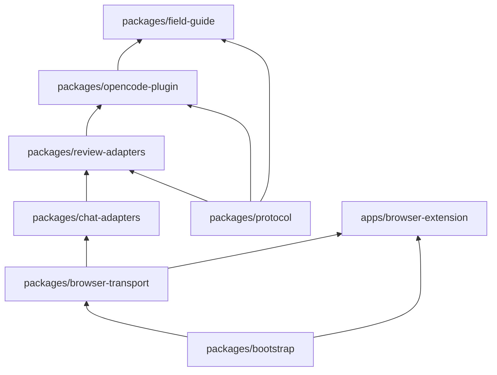

# Architecture

System architecture, dependency graph, one source of truth.

## Monorepo Layout

```
PlanLoop/
├── packages/
│   ├── spec/                  # Phase -2 — Product spec, contracts, events, ADRs, acceptance tests, manifest
│   ├── bootstrap/             # Phase -1 — Developer Experience: installer, diagnostics, health checks
│   ├── protocol/              # Phase 0 — JSON Schemas, validators, fixtures, compat tests
│   ├── browser-transport/     # Phase 1 — WebSocket bridge + extension (transport-agnostic)
│   ├── chat-adapters/         # Phase 2 — ChatGPT chat adapter on top of transport
│   ├── review-adapters/       # Phase 2 — ReviewAdapter implementations
│   ├── opencode-plugin/       # Phase 3–4 — OpenCode plugin + orchestrator
│   └── field-guide/           # Phase 5 — Knowledge Engine: extractor, storage, index, planner integration
├── apps/
│   └── browser-extension/     # Chrome/Edge MV3 extension (generic transport client)
└── package.json               # npm workspaces (Bun-compatible)
```

## Dependency Flow Graph

Dependency direction (strict, no cycles). Arrows flow from foundation upward — `A --> B` reads "A feeds into B":



> Note: `Bootstrap --> Transport` and `Bootstrap --> Extension` are runtime
> orchestration flows (setup starts the bridge and builds the extension via
> spawned commands — bootstrap never imports them; see non-goals).
> `Plugin --> FieldGuide` is a data flow (the plugin produces run archives that
> the Field Guide consumes; the code dependency is `field-guide → protocol` and
> `opencode-plugin → field-guide`). Code dependencies are exactly the
> authoritative edges below.

## Authoritative Dependency Edges

Code dependencies, per `repository-manifest.md`. Architecture tests parse
`package.json` dependencies and compare against this list.

| Package | Code Dependencies |
|---------|-------------------|
| `packages/spec` | (none) |
| `packages/bootstrap` | (none) |
| `packages/protocol` | `ajv` |
| `packages/browser-transport` | `ws` |
| `packages/chat-adapters` | `@planloop/browser-transport` |
| `packages/review-adapters` | `@planloop/protocol`, `@planloop/chat-adapters`, `@planloop/browser-transport` |
| `packages/opencode-plugin` | `@planloop/protocol`, `@planloop/review-adapters`, `@planloop/field-guide` |
| `packages/field-guide` | `@planloop/protocol` |
| `apps/browser-extension` | `@planloop/browser-transport` |

## Folder Ownership (One Source of Truth)

Every concept has exactly one owner. No duplication.

| Concept | Owner Package | NEVER Owned By |
|---------|---------------|----------------|
| Protocol schemas | `packages/protocol` | Any other package |
| Packet types | `packages/protocol` | Any other package |
| Approval rules | `packages/protocol` | `opencode-plugin` |
| Reasoning traces | `packages/protocol` | `opencode-plugin` |
| Browser primitives | `packages/browser-transport` | `protocol`, `chat-adapters` |
| WebSocket bridge | `packages/browser-transport` | `opencode-plugin` |
| Extension DOM selectors | `apps/browser-extension` | `browser-transport` |
| ChatGPT prompt format | `packages/chat-adapters` | `review-adapters` |
| ReviewAdapter interface | `packages/review-adapters` | `chat-adapters` |
| Adapter registry | `packages/review-adapters` | `opencode-plugin` |
| State machine | `packages/opencode-plugin` | Any other package |
| Repository Brief | `packages/opencode-plugin` | Any other package |
| Plan revision logic | `packages/opencode-plugin` | `field-guide` |
| Run archival | `packages/opencode-plugin` | `field-guide` |
| Field Guide storage | `packages/field-guide` | `opencode-plugin` |
| Knowledge extraction | `packages/field-guide` | `opencode-plugin` |
| Lesson metadata | `packages/field-guide` | `opencode-plugin` |
| Planner injection | `packages/field-guide` | `opencode-plugin` |
| Environment detection | `packages/bootstrap` | Any other package |
| Setup orchestration | `packages/bootstrap` | Any other package |
| Diagnostics | `packages/bootstrap` | Any other package |
| Product definition | `packages/spec` | Any other package |
| ADRs | `packages/spec` | Any other package |
| Acceptance tests | `packages/spec` | Any other package |
